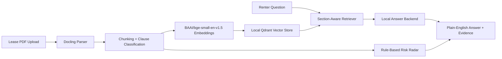

# LeaseSense

LeaseSense is a local-first AI lease analysis project for renters. It parses lease PDFs, indexes clauses into a local vector store, answers renter questions with cited evidence, and flags lease-risk patterns such as subleasing restrictions, joint liability, occupancy limits, deposits, unauthorized occupants, and early termination.

> LeaseSense is not legal advice. It is an educational tool for reviewing lease language and identifying issues to verify with a landlord, tenant organization, or qualified attorney.

## Features and specs

LeaseSense is structured to show applied AI engineering skills beyond a basic RAG demo:

- Local document ingestion with Docling
- Clause chunking and vector search with Qdrant
- Sentence-transformers embeddings using `BAAI/bge-small-en-v1.5`
- Pluggable local LLM backends
- Rule-based risk radar with evidence
- Clause intelligence that labels retrieved evidence by lease section
- Section-aware retrieval filters and evidence dashboard
- Retrieval and answer evaluation harness
- Streamlit product UI
- FastAPI service entrypoint
- Docker setup
- Unit tests for core behavior

No paid APIs are required.

## Product Demo Flow

1. Upload a lease PDF.
2. LeaseSense parses it with Docling.
3. The ingestion pipeline chunks clauses and labels each chunk by section.
4. Embeddings are generated locally and stored in local Qdrant.
5. Ask a question in the `Ask` tab, optionally filtering retrieval to a lease section.
6. LeaseSense returns a plain-English answer with cited evidence.
7. Inspect risk flags, grouped evidence, and parsed text in dedicated tabs.

For a portfolio walkthrough, see [PORTFOLIO.md](PORTFOLIO.md) and [docs/demo-script.md](docs/demo-script.md).

## Architecture



## What This Demonstrates

- Local-first AI product engineering
- RAG architecture with cited evidence
- Metadata-aware retrieval
- Model-provider abstraction
- Deterministic offline fallback behavior
- Evaluation and test discipline
- Product-focused Streamlit UX
- API and Docker deployment paths

## Key Tradeoffs

- The default `template` backend is reliable and lightweight, but less fluent than a local LLM.
- The fallback embedder keeps demos running without model downloads, but retrieval quality is lower than BGE embeddings.
- Rule-based risk detection is explainable, but it should be expanded with richer labeled examples before legal-adjacent production use.
- Qdrant local mode is great for an MVP; a deployed product would use a managed or server-backed vector database.

## Supported Answer Backends

Set `LLM_BACKEND` in `.env` or choose a backend in the Streamlit sidebar.

| Backend | Value | Use Case |
| --- | --- | --- |
| Deterministic template | `template` | Fast offline demos, tests, and reliable fallback |
| Ollama | `ollama` | Simple local chat model runtime |
| llama.cpp | `llama_cpp` | Local GGUF models from Hugging Face |
| Hugging Face Transformers | `transformers` | Python-native local model loading |

Recommended portfolio setup:

```env
LLM_BACKEND=llama_cpp
LLAMA_CPP_MODEL_PATH=models/qwen2.5-3b-instruct-q4_k_m.gguf
```

For Ollama:

```bash
ollama pull qwen2.5:3b
ollama serve
```

## Setup

```bash
python -m venv .venv
.venv\Scripts\activate
pip install -r requirements.txt
copy .env.example .env
streamlit run app.py
```

The first run may take time if `ALLOW_MODEL_DOWNLOAD=true` and the embedding model is not already cached. By default, model downloads are disabled and LeaseSense falls back to a deterministic local embedder if the sentence-transformers model is unavailable.

## Run The API

```bash
uvicorn leasesense.api.main:app --reload
```

Endpoints:

- `GET /health`
- `POST /ask`

The Streamlit app remains the main upload workflow. The API demonstrates how the RAG service can be exposed separately for production-style architecture.

## Run Evals

```bash
python -m leasesense.evals.runner path\to\lease.pdf --backend template
python -m leasesense.evals.runner path\to\lease.pdf --backend template --json
```

The smoke eval reports:

- Retrieval term recall
- Whether expected risk categories were detected
- Whether answers include evidence sections

This is intentionally lightweight, but it gives the project an evaluation story that most RAG demos lack.

## Run Tests

```bash
pytest
```

Current tests cover:

- Chunking behavior
- Rule-based risk detection
- Required answer sections from the template provider
- Clause classification
- Section-filter retrieval plumbing

## Command Shortcuts

Linux/macOS or environments with `make`:

```bash
make run
make api
make test
make compile
make eval PDF=path/to/lease.pdf
make docker
```

Windows-friendly commands are listed in [TASKS.md](TASKS.md).

## Portfolio Assets

- [PORTFOLIO.md](PORTFOLIO.md): resume bullets, talking points, and case-study copy
- [docs/demo-script.md](docs/demo-script.md): walkthrough script for a recording
- [docs/screenshots](docs/screenshots): screenshot checklist and target filenames
- [RELEASE_CHECKLIST.md](RELEASE_CHECKLIST.md): final checklist before sharing publicly

## Docker

```bash
docker compose up --build
```

The Docker default uses `LLM_BACKEND=template` so it can run without a model server. For local model backends, mount model files or connect to the relevant local service.

## Project Structure

```text
LeaseSense/
  app.py                         Streamlit UI
  leasesense/
    api/                         FastAPI service entrypoint
    app/                         App entrypoint wrappers
    analysis/                    RAG and risk-analysis facade
    core/                        Config, models, logging facade
    evals/                       Evaluation datasets, metrics, runner
    ingestion/                   PDF parsing, chunking, ingestion pipeline
      clause_classifier.py       Section and clause-type metadata detection
    llm/                         Template, Ollama, llama.cpp, Transformers providers
    retrieval/                   Embeddings, retriever, vector store facade
    chunking.py                  Compatibility module
    config.py                    Environment-driven settings
    embeddings.py                Sentence-transformers + fallback embedder
    parsing.py                   Docling PDF parser
    rag.py                       RAG orchestration
    risk.py                      Rule-based risk radar
    vector_store.py              Local Qdrant adapter
  tests/
```

## Environment

```env
EMBEDDING_MODEL=BAAI/bge-small-en-v1.5
ALLOW_MODEL_DOWNLOAD=false
QDRANT_PATH=data/qdrant
QDRANT_COLLECTION=lease_chunks
LLM_BACKEND=template
OLLAMA_BASE_URL=http://localhost:11434
OLLAMA_MODEL=qwen2.5:3b
LLAMA_CPP_MODEL_PATH=
TRANSFORMERS_MODEL=Qwen/Qwen2.5-3B-Instruct
```

## Next Engineering Milestones

- Add reranking with a local cross-encoder
- Add golden-answer evals with faithfulness checks
- Add upload and ingestion endpoints to the FastAPI service
- Add CI linting with Ruff
- Add a richer document dashboard with upload history
